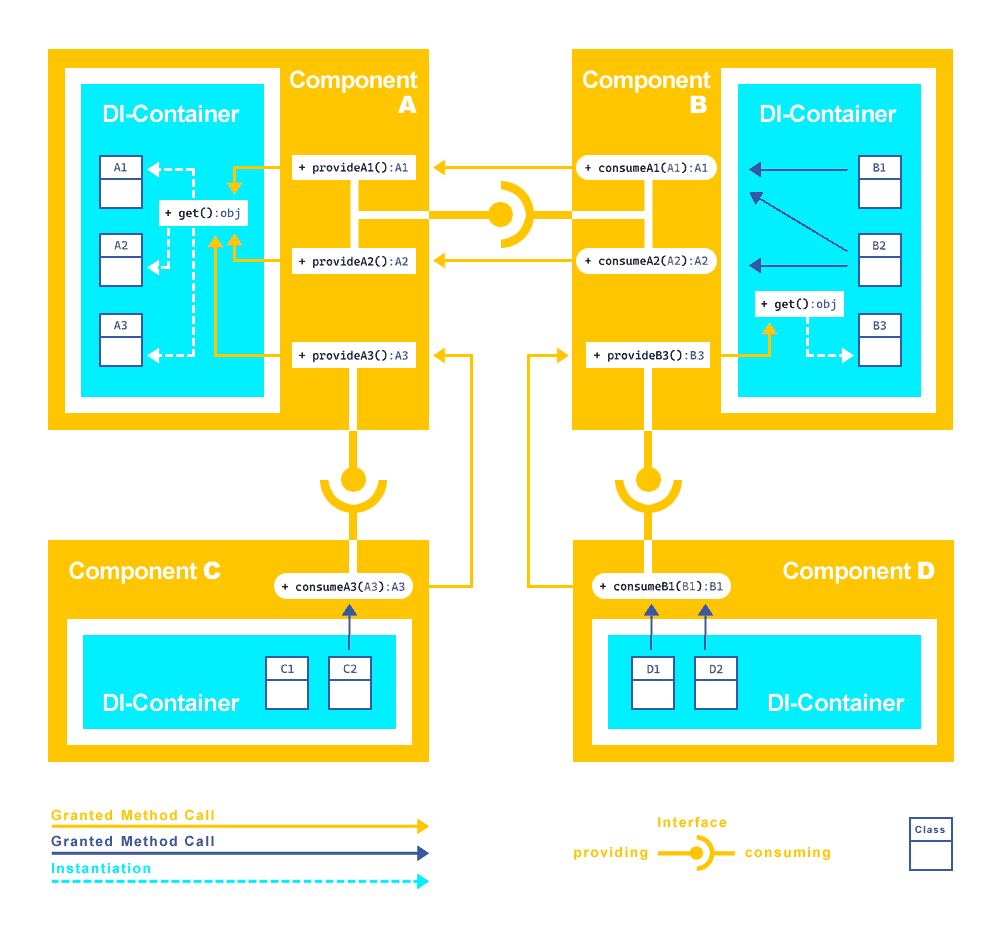

# An extended Component Diagramm

This is a loose-syntax diagram of what the
[Miniature\Component wiring](https://github.com/guidoerfen/miniature-component#wiring-the-coupling)
is trying to achieve.
The interface notation might appear a bit redundant.
They just were adopted from the average
[component diagram](https://en.wikipedia.org/wiki/Component_diagram)
notation and since these components are globally accessible singletons
they do not mean then components must implement a certain interface.
The wiring is the contract.
The method-call arrows show what is allowed per coupling-wiring and thus illustrate how the interface-providing is released.

* `ComponentA->provideA1()` allows only to be called by `ComponentB->consumeA1()`
* While `ComponentB->consumeA1()` allows only to be called by two classes from inside it's own DI-Container. No methods are specified in this example, but self-speaking it could be done.
* But class `B1`is not allowed to call `ComponentB->consumeA1()`

All those public `provide` and `consume` methods are all getter methods actually.
You might consider them getters sitting on an castle wall
on demand lowering down service staff on ropes in both directions.

Don't misunderstand the method-call and instantiation arrows as data stream directions.
Directions could be either ways in the end result.
Provider methods should not directly trigger functionality but deliver "service facades"
which in return provide access to well-chosen functionality.



The relations as shown above would result in a wiring like this:

```YML
coupling:
    ComponentA:
        provideA1:
            ComponentB:
                consumeA1: true
        provideA2:
            ComponentB:
                consumeA2: true
        provideA3:
            Componentc:
                consumeA3: true
    ComponentB:
        consumeA1:
            B1: true
            B2: true
        consumeA2:
            B2: true
        provideB3:
            ComponentD: 
                consumeB1: true
    ComponentC:
        consumeA3:
            C2: true
    ComponentD:
        consumeB1:
            D1: true
            D2: true
            
```